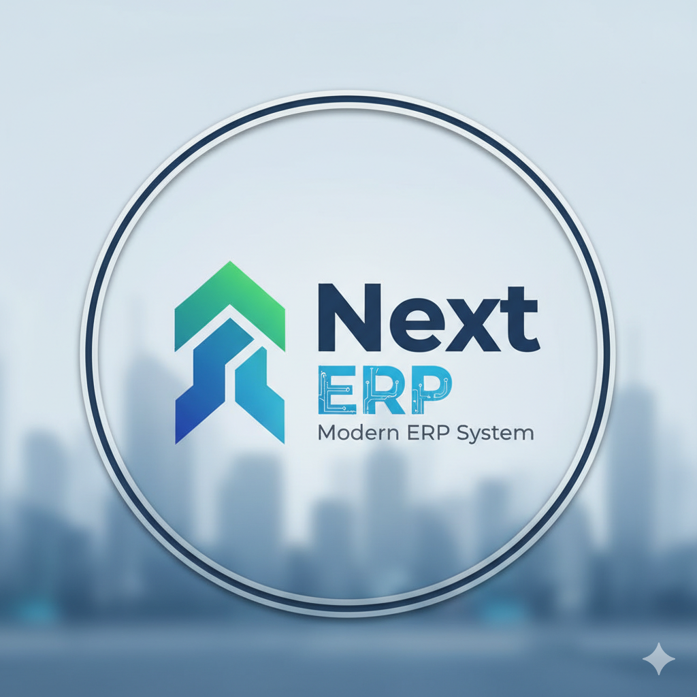

<div align="center">



# 🚀 Next-ERP - Enterprise Resource Planning System


**A modern, modular ERP system built with Laravel 10 and Filament 3**

[Features](#-features) • [Installation](#-installation) • [Modules](#-modules) • [Documentation](#-documentation) • [Contributing](#-contributing)

</div>

---

## 📋 Table of Contents

- [Overview](#-overview)
- [Key Features](#-features)
- [Technology Stack](#-technology-stack)
- [System Requirements](#-system-requirements)
- [Installation](#-installation)
- [Modules](#-modules)
- [Architecture](#-architecture)
- [Usage](#-usage)
- [API Documentation](#-api-documentation)
- [Testing](#-testing)
- [Contributing](#-contributing)
- [License](#-license)

---

## 🌟 Overview

**Next-ERP** is a comprehensive, open-source Enterprise Resource Planning system designed for modern SME businesses. Built on Laravel 10 and powered by Filament 3's admin panel, it provides a modular, scalable solution for managing all aspects of your business operations.

### Why Next-ERP?

✅ **Modular Architecture** - Pick and choose modules as needed  
✅ **Modern Tech Stack** - Laravel 10, Filament 3, Livewire 3  
✅ **Role-Based Access Control** - Granular permissions system  
✅ **Event-Driven** - Real-time updates and automation  
✅ **Docker Ready** - Easy deployment with Docker Compose  
✅ **Fully Customizable** - Extend and customize to your needs  
✅ **Open Source** - MIT Licensed

---

## ✨ Features

### 🎯 Core Capabilities

- **Multi-Module System** - 10 integrated business modules
- **Advanced RBAC** - 4 roles, 45+ permissions
- **Real-time Dashboard** - Live widgets and analytics
- **Audit Trail** - Complete activity logging
- **Multi-Currency Support** - International business ready
- **Multi-Warehouse** - Manage multiple locations
- **Event-Driven Architecture** - Automated business workflows
- **Responsive UI** - Mobile-friendly Filament interface
- **Dark Mode** - Eye-friendly dark theme support
- **Data Export** - PDF, Excel, CSV exports

### 📊 Business Intelligence

- **Dynamic Dashboards** - Customizable widgets
- **Real-time Reports** - Sales, inventory, financial reports
- **Analytics Charts** - Visual data representation
- **KPI Tracking** - Monitor business metrics
- **Scheduled Reports** - Automated report generation

### 🔒 Security Features

- **Role-Based Permissions** - Spatie Laravel Permission
- **Activity Logging** - Track all user actions
- **Soft Deletes** - Recoverable data deletion
- **Data Validation** - Comprehensive input validation
- **CSRF Protection** - Laravel security features
- **Authentication** - Secure user authentication

---

## 🛠️ Technology Stack

### Backend
- **Framework**: Laravel 10.x
- **PHP**: 8.1+
- **Admin Panel**: Filament 3.0
- **Authorization**: Spatie Laravel Permission 6.x
- **Real-time**: Livewire 3.4

### Frontend
- **UI Framework**: Tailwind CSS 3.x
- **Components**: Filament UI Components
- **JavaScript**: Alpine.js (via Livewire)
- **Build Tool**: Vite

### Database
- **Primary**: PostgreSQL 15
- **Migrations**: Laravel Migrations
- **ORM**: Eloquent ORM
- **Relationships**: Full relational database design

### Infrastructure
- **Containerization**: Docker & Docker Compose
- **Web Server**: Nginx (in Docker)
- **Cache**: Redis
- **Queue**: Redis Queue
- **Storage**: Local & S3 compatible

### Development Tools
- **Package Manager**: Composer 2.x
- **Code Quality**: Laravel Pint
- **Testing**: PHPUnit 10.x
- **API Testing**: Postman collections

---

## 💻 System Requirements

### Minimum Requirements

```
PHP           >= 8.1
Composer      >= 2.0
Node.js       >= 18.x
NPM           >= 9.x
PostgreSQL    >= 13
Redis         >= 6.x (optional)
```

### Recommended Requirements

```
PHP           8.2+
PostgreSQL    15+
Redis         7.x
Memory        2GB RAM minimum
Storage       10GB free space
```

### Extensions Required

```
php-pdo
php-mbstring
php-xml
php-bcmath
php-curl
php-gd
php-intl
php-zip
php-redis (optional)
```

---

## 🚀 Installation

### Method 1: Docker Installation (Recommended)

1. **Clone the repository**
```bash
git clone https://github.com/zakirkun/next-erp.git
cd next-erp
```

2. **Copy environment file**
```bash
cp .env.example .env
```

3. **Start Docker containers**
```bash
docker-compose up -d
```

4. **Install dependencies**
```bash
docker-compose exec app composer install
docker-compose exec app npm install
```

5. **Generate application key**
```bash
docker-compose exec app php artisan key:generate
```

6. **Run migrations and seeders**
```bash
docker-compose exec app php artisan migrate --seed
```

7. **Build assets**
```bash
docker-compose exec app npm run build
```

8. **Access the application**
```
URL: http://localhost:8000/admin
Email: admin@next-erp.com
Password: password
```

### Method 2: Manual Installation

1. **Clone and install dependencies**
```bash
git clone https://github.com/zakirkun/next-erp.git
cd next-erp
composer install
npm install
```

2. **Configure environment**
```bash
cp .env.example .env
php artisan key:generate
```

3. **Configure database in `.env`**
```env
DB_CONNECTION=pgsql
DB_HOST=127.0.0.1
DB_PORT=5432
DB_DATABASE=next_erp
DB_USERNAME=your_username
DB_PASSWORD=your_password
```

4. **Run migrations and seeders**
```bash
php artisan migrate --seed
```

5. **Build frontend assets**
```bash
npm run build
```

6. **Start the application**
```bash
php artisan serve
```

7. **Access the admin panel**
```
URL: http://127.0.0.1:8000/admin
Email: admin@next-erp.com
Password: password
```

---

## 📦 Modules

Next-ERP consists of 10 integrated business modules:

### 1. 🏢 Core Module
**Status**: ✅ Complete (85%)

The foundation of the system providing essential functionality.

**Features:**
- ✅ Company Settings Management
- ✅ Activity Logs & Audit Trail
- ✅ System Configuration
- ✅ Notification System
- ✅ Backup & Restore

**Resources:**
- Company Settings
- Activity Logs
- System Notifications
- Backup Manager

---

### 2. 👥 HR Module
**Status**: ✅ Complete (95%)

Comprehensive human resource management system.

**Features:**
- ✅ Employee Management (Full CRUD)
- ✅ Department & Position Management
- ⏳ Attendance Tracking
- ⏳ Payroll Processing
- ⏳ Leave Management
- ⏳ Performance Reviews
- ⏳ Document Management

**Models:**
- Employee (Complete)
- Department
- Position
- Attendance (Planned)
- Payroll (Planned)
- Leave (Planned)

**Resources:**
- EmployeeResource ✅

---

### 3. 📦 Inventory Module
**Status**: ✅ Complete (95%)

Advanced inventory and warehouse management.

**Features:**
- ✅ Product Management (SKU, Barcode)
- ✅ Multi-Warehouse Support
- ✅ Stock Level Tracking
- ✅ Stock Movement History
- ✅ Category & Brand Management
- ✅ Unit of Measure
- ✅ Low Stock Alerts
- ✅ Inventory Valuation

**Models:**
- Product ✅
- Category ✅
- Brand ✅
- Unit ✅
- Warehouse ✅
- StockLevel ✅
- StockMovement ✅

**Resources:**
- ProductResource ✅
- CategoryResource ✅
- BrandResource ✅
- WarehouseResource ✅
- StockLevelResource ✅
- StockMovementResource ✅

**Key Features:**
- Image upload for products
- Hierarchical category structure
- Real-time stock tracking
- Automatic reorder point alerts
- FIFO/LIFO/Average costing methods

---

### 4. 💰 Finance Module
**Status**: ✅ Complete (100%)

Full-featured accounting and financial management.

**Features:**
- ✅ Chart of Accounts (Hierarchical)
- ✅ Journal Entry System
- ✅ Double-Entry Bookkeeping
- ✅ General Ledger
- ✅ Balance Calculation
- ⏳ Cash & Bank Management
- ⏳ Financial Reports (Balance Sheet, P&L, Cash Flow)
- ⏳ Accounts Payable/Receivable

**Models:**
- Account ✅ (5 types: Asset, Liability, Equity, Revenue, Expense)
- Journal ✅ (Draft → Posted → Reversed)
- JournalEntry ✅ (Debit/Credit validation)

**Resources:**
- AccountResource ✅ (Hierarchical display, balance calculation)
- JournalResource ✅ (Auto-balancing, line items)

**Key Features:**
- Auto-generated journal numbers: `JRN-20251009-0001`
- Parent-child account relationships
- Smart balance calculation by account type
- Double-entry validation (debit = credit)
- Color-coded account type badges
- Soft delete support

---

### 5. 🛒 Sales Module
**Status**: ✅ Complete (85%)

Complete sales workflow management.

**Features:**
- ✅ Customer Management
- ✅ Quotations/Estimates
- ✅ Sales Orders
- ✅ Invoicing
- ✅ Payment Tracking
- ✅ Balance Calculation
- ⏳ Sales Analytics
- ⏳ Customer Statements

**Models:**
- Customer ✅
- Quotation ✅
- QuotationItem ✅
- SalesOrder ✅
- SalesOrderItem ✅
- Invoice ✅
- Payment ✅

**Resources:**
- CustomerResource ✅
- QuotationResource ✅ (with repeater for line items)
- SalesOrderResource ✅ (convert from quotation)
- InvoiceResource ✅ (generate from sales order)
- PaymentResource ✅ (track payments, update balance)

**Workflow:**
```
Customer → Quotation → Sales Order → Invoice → Payment
```

**Events:**
- SalesOrderCreated
- SalesOrderDelivered
- InvoicePaid

---

### 6. 📋 Purchasing Module
**Status**: ✅ Complete (100%)

Procurement and vendor management system.

**Features:**
- ✅ Vendor Management
- ✅ Purchase Orders
- ✅ Purchase Order Line Items
- ✅ Goods Receipt Tracking
- ✅ Outstanding Amount Calculation
- ⏳ Purchase Requests
- ⏳ Purchase Invoices
- ⏳ Vendor Performance Reports

**Models:**
- Vendor ✅ (with auto-generated codes: `VEN-000001`)
- PurchaseOrder ✅ (6 status workflow)
- PurchaseOrderItem ✅
- GoodsReceipt ✅
- GoodsReceiptItem ✅

**Resources:**
- VendorResource ✅ (contact info, credit limit, payment terms)
- PurchaseOrderResource ✅ (repeater for items, auto-totals)

**Workflow:**
```
Vendor → Purchase Order → Goods Receipt → Stock Update
```

**Key Features:**
- Auto-generated PO numbers: `PO-20251009-0001`
- Status: Draft → Pending → Approved → Partial → Completed → Cancelled
- Automatic calculation: subtotal, tax, discount, shipping
- Outstanding amount tracking
- Expected delivery date management

**Events:**
- PurchaseOrderReceived

---

### 7. 🏭 Production Module
**Status**: 🟡 Pending (0%)

Manufacturing and production management.

**Planned Features:**
- Bill of Materials (BoM)
- Work Orders
- Production Planning
- Production Tracking
- Quality Control
- Production Reports

**Models (Planned):**
- BillOfMaterial
- WorkOrder
- ProductionPlan
- ProductionOutput
- QualityCheck

---

### 8. 🚛 Logistics Module
**Status**: 🟡 Pending (0%)

Shipping and delivery management.

**Planned Features:**
- Delivery Orders
- Route Planning
- Driver Management
- Shipment Tracking
- Courier Integration
- Delivery Reports

**Models (Planned):**
- DeliveryOrder
- Shipment
- Driver
- Vehicle
- Route
- TrackingEvent

---

### 9. 📞 CRM Module
**Status**: 🟡 Pending (0%)

Customer relationship management.

**Planned Features:**
- Leads & Opportunities
- Sales Pipeline
- Contact Management
- Follow-up Tasks
- Customer Analytics
- Loyalty Programs

**Models (Planned):**
- Lead
- Opportunity
- Contact
- Activity
- Task
- Campaign

---

### 10. 📈 Reports Module
**Status**: 🟡 Pending (0%)

Business intelligence and analytics.

**Planned Features:**
- Custom Report Builder
- Dashboard Widgets
- Business Analytics
- Export (PDF, Excel, CSV)
- Scheduled Reports
- KPI Tracking

---

## 🏗️ Architecture

### Modular Structure

```
next-erp/
├── app/
│   ├── Events/              # Event classes
│   │   ├── InvoicePaid.php
│   │   ├── PurchaseOrderReceived.php
│   │   ├── SalesOrderCreated.php
│   │   └── SalesOrderDelivered.php
│   ├── Listeners/           # Event listeners
│   │   ├── AddInventoryFromPurchase.php
│   │   ├── DeductInventoryFromSales.php
│   │   ├── RecordPaymentReceipt.php
│   │   ├── RecordPurchaseExpense.php
│   │   └── RecordSalesRevenue.php
│   └── Providers/
│       └── ModuleServiceProvider.php  # Auto-discovery
├── modules/                 # Business modules
│   ├── Core/
│   │   ├── Models/
│   │   ├── Resources/
│   │   └── routes.php
│   ├── Finance/
│   │   ├── Models/
│   │   │   ├── Account.php
│   │   │   ├── Journal.php
│   │   │   └── JournalEntry.php
│   │   └── Resources/
│   │       ├── AccountResource.php
│   │       └── JournalResource.php
│   ├── Purchasing/
│   │   ├── Models/
│   │   │   ├── Vendor.php
│   │   │   ├── PurchaseOrder.php
│   │   │   ├── PurchaseOrderItem.php
│   │   │   ├── GoodsReceipt.php
│   │   │   └── GoodsReceiptItem.php
│   │   └── Resources/
│   ├── Sales/
│   │   ├── Models/
│   │   │   ├── Customer.php
│   │   │   ├── Quotation.php
│   │   │   ├── SalesOrder.php
│   │   │   ├── Invoice.php
│   │   │   └── Payment.php
│   │   └── Resources/
│   ├── Inventory/
│   │   ├── Models/
│   │   │   ├── Product.php
│   │   │   ├── Category.php
│   │   │   ├── Warehouse.php
│   │   │   └── StockMovement.php
│   │   └── Resources/
│   └── HR/
├── database/
│   ├── migrations/
│   └── seeders/
│       ├── RoleSeeder.php
│       └── UserSeeder.php
└── docker/
    ├── nginx/
    └── php/
```

### Event-Driven Architecture

The system uses Laravel Events and Listeners for automated workflows:

**Sales Events:**
- `SalesOrderCreated` → Reserves inventory
- `SalesOrderDelivered` → `DeductInventoryFromSales` listener
- `InvoicePaid` → `RecordSalesRevenue` (Finance) + `RecordPaymentReceipt`

**Purchasing Events:**
- `PurchaseOrderReceived` → `AddInventoryFromPurchase` listener
- `PurchaseOrderReceived` → `RecordPurchaseExpense` (Finance)

### Database Design

- **Relational Database**: PostgreSQL 15
- **Soft Deletes**: All major tables
- **Indexes**: Optimized for performance
- **Foreign Keys**: Enforced relationships
- **Timestamps**: Created_at, Updated_at

### RBAC System

**Roles:**
1. **Super Admin** - Full system access
2. **Admin** - Administrative access
3. **Manager** - Departmental access
4. **User** - Limited access

**Permissions**: 45+ granular permissions across modules
- Format: `{module}.{action}` (e.g., `sales.create`, `inventory.view`)

---

## 📘 Usage

### Accessing the Admin Panel

1. Navigate to `http://localhost:8000/admin`
2. Login with default credentials:
   - Email: `admin@next-erp.com`
   - Password: `password`

### Dashboard Overview

The main dashboard provides:
- **Today's Sales** - Real-time sales metrics
- **Outstanding Invoices** - Pending payments
- **Low Stock Alerts** - Products below reorder point
- **Pending Orders** - Orders awaiting processing
- **Quick Actions** - Common tasks

### Common Workflows

#### Creating a Sales Order

1. **Navigate** to Sales → Customers
2. **Create** a new customer (if needed)
3. **Go to** Sales → Quotations
4. **Create** quotation with line items
5. **Convert** quotation to Sales Order
6. **Generate** invoice from Sales Order
7. **Record** payment when received

#### Managing Inventory

1. **Add Products** via Inventory → Products
2. **Set Categories** and Brands
3. **Configure Warehouses**
4. **Track Stock** via Stock Movements
5. **Monitor** Low Stock Alerts

#### Purchase Order Flow

1. **Create Vendor** in Purchasing → Vendors
2. **Create PO** with line items
3. **Approve** Purchase Order
4. **Receive Goods** via Goods Receipt
5. **Stock Auto-Updates** via event listener

#### Accounting

1. **Setup Chart of Accounts** in Finance → Accounts
2. **Create** parent accounts (Assets, Liabilities, etc.)
3. **Add** child accounts under parents
4. **Post** Journal Entries
5. **Verify** debit = credit balance

---

## 🔌 API Documentation

### REST API Endpoints

```
POST   /api/auth/login          # User authentication
POST   /api/auth/logout         # User logout
GET    /api/auth/user           # Current user

GET    /api/products            # List products
POST   /api/products            # Create product
GET    /api/products/{id}       # Show product
PUT    /api/products/{id}       # Update product
DELETE /api/products/{id}       # Delete product

GET    /api/sales-orders        # List sales orders
POST   /api/sales-orders        # Create sales order
GET    /api/sales-orders/{id}   # Show sales order
PUT    /api/sales-orders/{id}   # Update sales order

# ... (more endpoints)
```

### Authentication

```bash
# Login
curl -X POST http://localhost:8000/api/auth/login \
  -H "Content-Type: application/json" \
  -d '{"email": "admin@next-erp.com", "password": "password"}'

# Use token in requests
curl -X GET http://localhost:8000/api/products \
  -H "Authorization: Bearer {token}"
```

---

## 🧪 Testing

### Running Tests

```bash
# Run all tests
php artisan test

# Run specific test suite
php artisan test --testsuite=Feature

# Run with coverage
php artisan test --coverage

# Run specific test file
php artisan test tests/Feature/InventoryTest.php
```

### Test Structure

```
tests/
├── Feature/
│   ├── InventoryTest.php
│   ├── SalesTest.php
│   ├── PurchasingTest.php
│   └── FinanceTest.php
└── Unit/
    ├── ProductTest.php
    ├── AccountTest.php
    └── JournalTest.php
```

---

## 🛠️ Development

### Useful Commands

```bash
# Clear all caches
php artisan optimize:clear

# Regenerate autoloader
composer dump-autoload

# Run migrations
php artisan migrate

# Rollback migrations
php artisan migrate:rollback

# Seed database
php artisan db:seed

# Create new migration
php artisan make:migration create_table_name

# Create new model
php artisan make:model Models/ModelName

# Create Filament resource
php artisan make:filament-resource ResourceName

# Run queue worker
php artisan queue:work

# Run scheduler
php artisan schedule:work
```

### Code Style

This project uses Laravel Pint for code formatting:

```bash
# Format code
./vendor/bin/pint

# Check formatting
./vendor/bin/pint --test
```

---

## 📊 Database Schema

### Key Tables

**Core Tables:**
- `users` - System users
- `roles` - User roles
- `permissions` - System permissions
- `model_has_roles` - User-role assignments

**Finance Tables:**
- `accounts` - Chart of accounts (hierarchical)
- `journals` - Journal vouchers
- `journal_entries` - Journal line items

**Sales Tables:**
- `customers` - Customer database
- `quotations` - Sales quotations
- `sales_orders` - Confirmed orders
- `invoices` - Sales invoices
- `payments` - Payment records

**Purchasing Tables:**
- `vendors` - Vendor database
- `purchase_orders` - Purchase orders
- `purchase_order_items` - PO line items
- `goods_receipts` - Goods received
- `goods_receipt_items` - GR line items

**Inventory Tables:**
- `products` - Product catalog
- `categories` - Product categories
- `brands` - Product brands
- `warehouses` - Warehouse locations
- `stock_levels` - Current stock
- `stock_movements` - Stock history

---

## 🤝 Contributing

We welcome contributions! Please follow these steps:

1. **Fork** the repository
2. **Create** a feature branch (`git checkout -b feature/AmazingFeature`)
3. **Commit** your changes (`git commit -m 'Add some AmazingFeature'`)
4. **Push** to the branch (`git push origin feature/AmazingFeature`)
5. **Open** a Pull Request

### Contribution Guidelines

- Follow PSR-12 coding standards
- Write tests for new features
- Update documentation
- Keep commits atomic and meaningful
- Ensure all tests pass

---

## 📝 License

This project is licensed under the MIT License - see the [LICENSE](LICENSE) file for details.

---

## 👥 Authors

- **Zakir Kun** - *Initial work* - [@zakirkun](https://github.com/zakirkun)

---

## 🙏 Acknowledgments

- [Laravel](https://laravel.com/) - The PHP Framework
- [Filament](https://filamentphp.com/) - Admin Panel
- [Livewire](https://laravel-livewire.com/) - Full-stack Framework
- [Spatie](https://spatie.be/) - Laravel Permission Package
- [Tailwind CSS](https://tailwindcss.com/) - CSS Framework

---

## 📞 Support

- **Documentation**: [docs/](docs/)
- **Issues**: [GitHub Issues](https://github.com/zakirkun/next-erp/issues)
- **Discussions**: [GitHub Discussions](https://github.com/zakirkun/next-erp/discussions)

---

## 🗺️ Roadmap

### Version 1.0 (Current)
- ✅ Core Module
- ✅ HR Module
- ✅ Inventory Module
- ✅ Finance Module
- ✅ Sales Module
- ✅ Purchasing Module

### Version 1.1 (Q1 2025)
- ⏳ Production Module
- ⏳ Logistics Module
- ⏳ CRM Module
- ⏳ Reports & Analytics
- ⏳ Mobile Application

### Version 2.0 (Q2 2025)
- ⏳ Multi-Company Support
- ⏳ Advanced Reporting
- ⏳ API Gateway
- ⏳ Third-party Integrations
- ⏳ Cloud Deployment

---

## 📈 Statistics

- **10 Modules** - Comprehensive business coverage
- **45+ Permissions** - Granular access control
- **30+ Models** - Rich data structure
- **20+ Resources** - Complete CRUD interfaces
- **5 Events** - Automated workflows
- **5 Listeners** - Business automation

---

<div align="center">

**Built with ❤️ using Laravel & Filament**

⭐ Star us on GitHub — it motivates us a lot!

[Report Bug](https://github.com/zakirkun/next-erp/issues) • [Request Feature](https://github.com/zakirkun/next-erp/issues)

</div>
